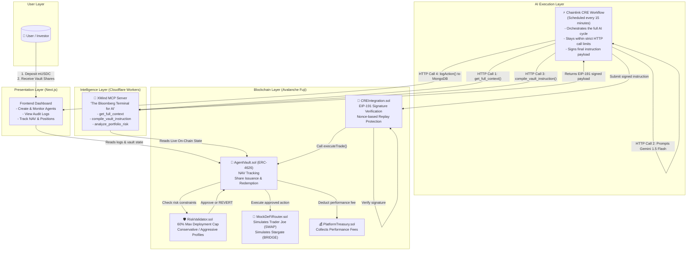
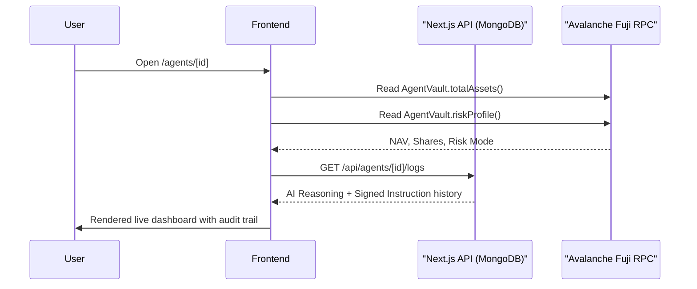
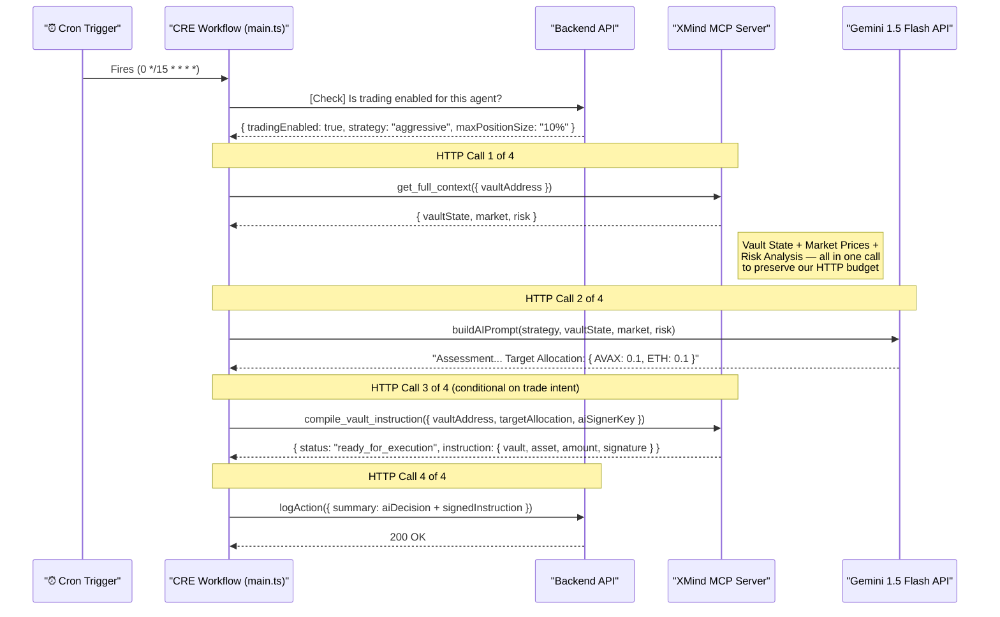
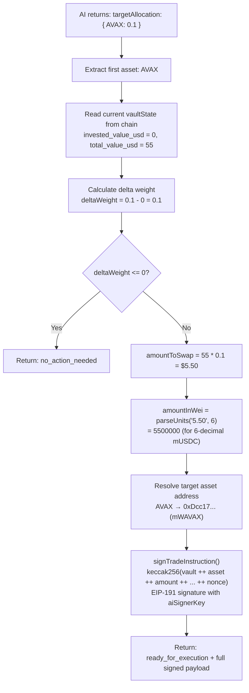
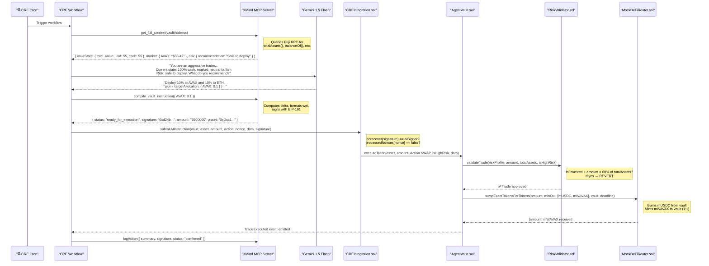

# XMind Capital AI Terminal

> **Autonomous, AI-Managed DeFi Vaults Secured by Cryptographic Guarantees on Avalanche**

XMind Capital bridges the gap between two worlds that usually don't talk to each other: the probabilistic reasoning of Large Language Models and the deterministic, unforgiving execution of smart contracts. The result is a portfolio management protocol where an AI agent autonomously makes trading decisions, but can never violate the hard-coded financial constraints that protect user capital — no matter what it "thinks" is a good idea.

---

## 🗺️ Table of Contents

- [The Core Problem](#the-core-problem)
- [System Architecture Overview](#system-architecture-overview)
- [Component Deep Dive](#component-deep-dive)
  - [1. The Frontend Dashboard](#1-the-frontend-dashboard-nextjs)
  - [2. The Chainlink CRE Workflow](#2-the-chainlink-cre-workflow-the-autonomous-agent)
  - [3. The XMind MCP Server (The AI's Brain)](#3-the-xmind-mcp-server-the-ais-brain)
  - [4. The Smart Contracts (Avalanche Fuji)](#4-the-smart-contracts-the-trustless-enforcer)
- [The Full End-to-End Trade Lifecycle](#the-full-end-to-end-trade-lifecycle)
- [Testnet Simulation Infrastructure](#testnet-simulation-infrastructure)
- [Getting Started](#getting-started)
- [Deployed Addresses (Avalanche Fuji)](#deployed-addresses-avalanche-fuji)
- [Tech Stack](#tech-stack)
- [Team](#team)

---

## The Core Problem

Giving an AI agent raw access to a DeFi wallet is one of the most dangerous things you can do in Web3. LLMs:

- **Hallucinate**: They confidently generate incorrect output. A hallucinated trade amount could be `1000x` the intended value.
- **Lack context**: They have no built-in concept of "don't drain the whole vault."
- **Are unconstrained by default**: Nothing stops a naive AI from deciding that the best move is to bridge 100% of a portfolio to a brand-new, unaudited chain.

Traditional solutions either keep the AI fully human-supervised (killing the "autonomous" value proposition) or grant it full access and hope for the best.

**XMind Capital takes a third path: the AI reasons freely, but the blockchain enforces the rules.**

---

## System Architecture Overview

The system is made of four distinct layers, each with a single, clear responsibility.



---

## Component Deep Dive

### 1. The Frontend Dashboard (Next.js)

The frontend is the user's window into what the AI is doing and why.

**Key pages:**
- **`/dashboard`** — Overview of all deployed vaults: cumulative NAV, utilization, and status.
- **`/agents/[id]`** — Deep dive on a single vault: live position breakdown, AI reasoning logs (full text of Gemini's decision), and the signed instruction payload for each trade cycle.
- **`/create`** — The agent creation wizard. Users configure the vault name, risk profile (Conservative / Balanced / Aggressive), and underlying strategy mandate before deploying through `VaultFactory`.

**Data Flow:**


---

### 2. The Chainlink CRE Workflow (The Autonomous Agent)

The CRE Workflow is the **orchestrator** — the thing that wakes up, thinks, decides, and acts, all without human intervention.

It runs on a **cron trigger every 15 minutes** and executes exactly 4 HTTP calls per cycle (the CRE imposes a strict limit of 5). Every slot is used efficiently:



**The critical design constraint that shaped the architecture:**
> The Chainlink CRE limits each workflow execution to **5 HTTP fetch calls**. Our original design used 3 calls just to gather context (`get_vault_state`, `get_market_snapshot`, `analyze_portfolio_risk`). This left only 1 call for Gemini and 1 for logging — no budget for the actual signing/compilation step.
>
> The solution was creating the `get_full_context` endpoint on the MCP server — a **server-side aggregation endpoint** that performs all three operations in parallel internally and returns a single merged response. This reduced context gathering from 3 calls to 1, freeing 2 slots for the compile and log steps.

---

### 3. The XMind MCP Server (The AI's Brain)

The MCP server is a **Cloudflare Worker** implementing the Model Context Protocol. It is the AI's interface to the real world — its Bloomberg Terminal. The AI cannot directly query the blockchain; it must go through the MCP.

**Core Tools:**

| Tool | Purpose | Internal Logic |
|---|---|---|
| `get_full_context` | Aggregated context feed | Runs `getVaultState()` + `getMarketSnapshot()` + `analyzePortfolioRisk()` in parallel |
| `compile_vault_instruction` | Converts AI intent → signed EVM payload | Reads vault state, computes delta weight, formats `amountInWei`, calls `signTradeInstruction()` |
| `get_vault_state` | Live vault snapshot | Queries `AgentVault` via ethers.js JsonRpcProvider — reads `totalAssets()`, `asset()`, `riskProfile()` |
| `analyze_portfolio_risk` | Risk score | Computes VaR, liquidity risk score, and issues a safety recommendation |
| `simulate_trade` | Pre-trade simulation | Predicts post-trade NAV and utilization without executing anything |

**The `compile_vault_instruction` pipeline in detail:**



---

### 4. The Smart Contracts (The Trustless Enforcer)

See the [contracts/README.md](./contracts/README.md) for a full deep dive. At a high level:

- **`AgentVault.sol`** — ERC-4626 vault. Holds user capital, tracks NAV dynamically, issues and redeems shares.
- **`CREIntegration.sol`** — The gatekeeper. Verifies every instruction was signed by the authorized AI signer before touching the vault.
- **`RiskValidator.sol`** — Stateless on-chain library that enforces capital caps regardless of what the AI wants.
- **`MockDeFiRouter.sol`** — Testnet simulation of Trader Joe (SWAP) and Stargate (BRIDGE). Mints mock output tokens at 1:1 to safely test execution.

---

## The Full End-to-End Trade Lifecycle

This sequence shows a single, complete trade cycle from AI wake-up to token appearing in the vault.



---

## Testnet Simulation Infrastructure

The Avalanche Fuji testnet doesn't have reliable liquidity on Trader Joe or fully functional Stargate bridges. Rather than stub out the execution entirely, we deployed a complete mock DeFi infrastructure that faithfully simulates the on-chain flow.

**Deployed Mock Contracts:**

| Contract | Address (Fuji) | Purpose |
|---|---|---|
| `VaultFactory.sol` | `0x05C5...` | Deploys new `AgentVault` instances |
| `MockDeFiRouter.sol` | `0x3A7F...` | Simulates TraderJoe SWAP + Stargate BRIDGE |
| `mUSDC` (base asset) | `0xF130...` | Vault's underlying stable asset |
| `mWAVAX` | `0xDcc1...` | Mock Wrapped AVAX (swap target) |
| `mWETH` | `0x5bC5...` | Mock Wrapped ETH (swap target) |
| `mWBTC` | `0xc92b...` | Mock Wrapped BTC (swap target) |
| `AgentVault` instance | `0x105e...` | Live demo vault |
| `CREIntegration` | `0x3f93...` | Signature verification gateway |

**How `MockDeFiRouter` simulates trades:**
```
SWAP:   Burns [amount] of input token from vault
        Mints [amount] of output token to vault (1:1 exchange rate)
        → Simple, predictable, great for demo

BRIDGE: Emits BridgeInitiated(srcChain, dstChain, amount) event
        → Simulates the bridge without cross-chain complexity

POOL:   Records deposit in depositedAmounts mapping
        harvestYield() mints 2% of deposit as yield tokens
        → Simulates lending protocol APY accrual
```

---

## Getting Started

### Prerequisites
- Node.js >= 18
- Bun (frontend)
- Hardhat (contracts)
- Cloudflare Wrangler (MCP server)
- Chainlink CRE CLI

### 1. Smart Contracts (Avalanche Fuji)
```bash
cd contracts
npm install
npx hardhat compile

# Deploy mock infrastructure for local testing
npx hardhat run scripts/deploy-testnet-mocks.js --network avalancheFuji
```

### 2. MCP Server (Local)
```bash
cd xmind-mcp
npm install
npx wrangler dev --port 8787
```

### 3. Chainlink CRE Simulation
```bash
cd xmind-cre
# Run the full autonomous agent cycle (simulate mode)
cre workflow simulate xmind-workflow --target staging-settings
```
Expected output confirms the pipeline completes with `ready_for_execution` status and a valid EIP-191 signature.

### 4. Frontend
```bash
cd frontend
bun install
bun dev
# Open http://localhost:3000
```

---

## Deployed Addresses (Avalanche Fuji)

| Contract | Address |
|---|---|
| `VaultFactory` | `0x05C5D5E05Ff8BB27e6A1A45CE7fB5de83D0B5c6a` |
| `CREIntegration` | `0x3f9320845083AC5Fd0dF1Aa330fb3506157fe918` |
| `AgentVault (Demo)` | `0x105eb8c8b9414f39f10d6d8f18b2d385c18a331b` |
| `MockDeFiRouter` | `0x3A7F6B5b87a92df3F4aa5038a4B2D44fAe13F5c3` |
| `mUSDC` | `0xF130b00B32EFE015FC080f7Dd210B0E937e627c2` |
| `mWAVAX` | `0xDcc1704257b818271359f117F349f16499bF128E` |
| `mWETH` | `0x5bC55a2641b20e0E2DCc977548aA672c3A7F03EC` |

---

## Tech Stack

| Layer | Technology |
|---|---|
| **AI Runtime** | Chainlink CRE SDK, `@chainlink/cre-sdk` |
| **Language Model** | Google Gemini 1.5 Flash |
| **Tool Protocol** | Model Context Protocol (MCP), `@modelcontextprotocol/sdk` |
| **MCP Hosting** | Cloudflare Workers, `wrangler` |
| **Blockchain** | Avalanche Fuji Testnet |
| **Smart Contracts** | Solidity ^0.8.20, OpenZeppelin v5, Hardhat |
| **Signing** | Ethers.js v6, EIP-191 |
| **Frontend** | Next.js 15 (App Router), TypeScript, Tailwind CSS |
| **Database** | MongoDB (Mongoose) — AI audit logs |

---
