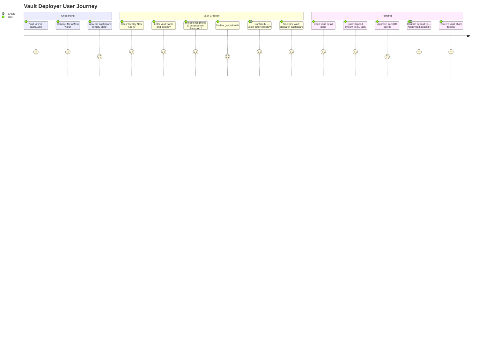
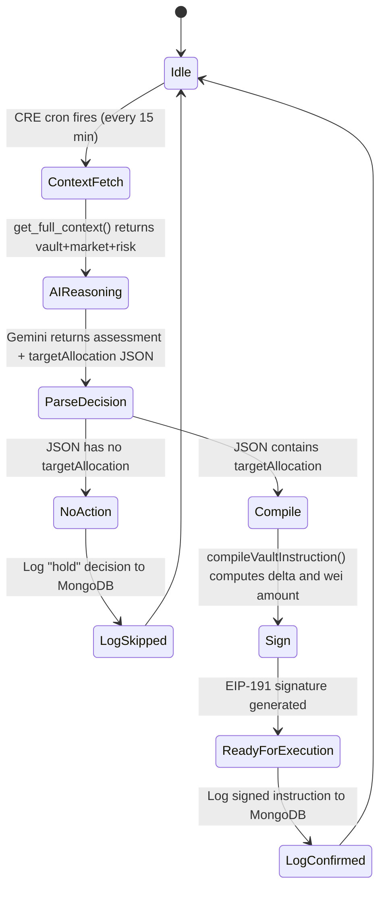
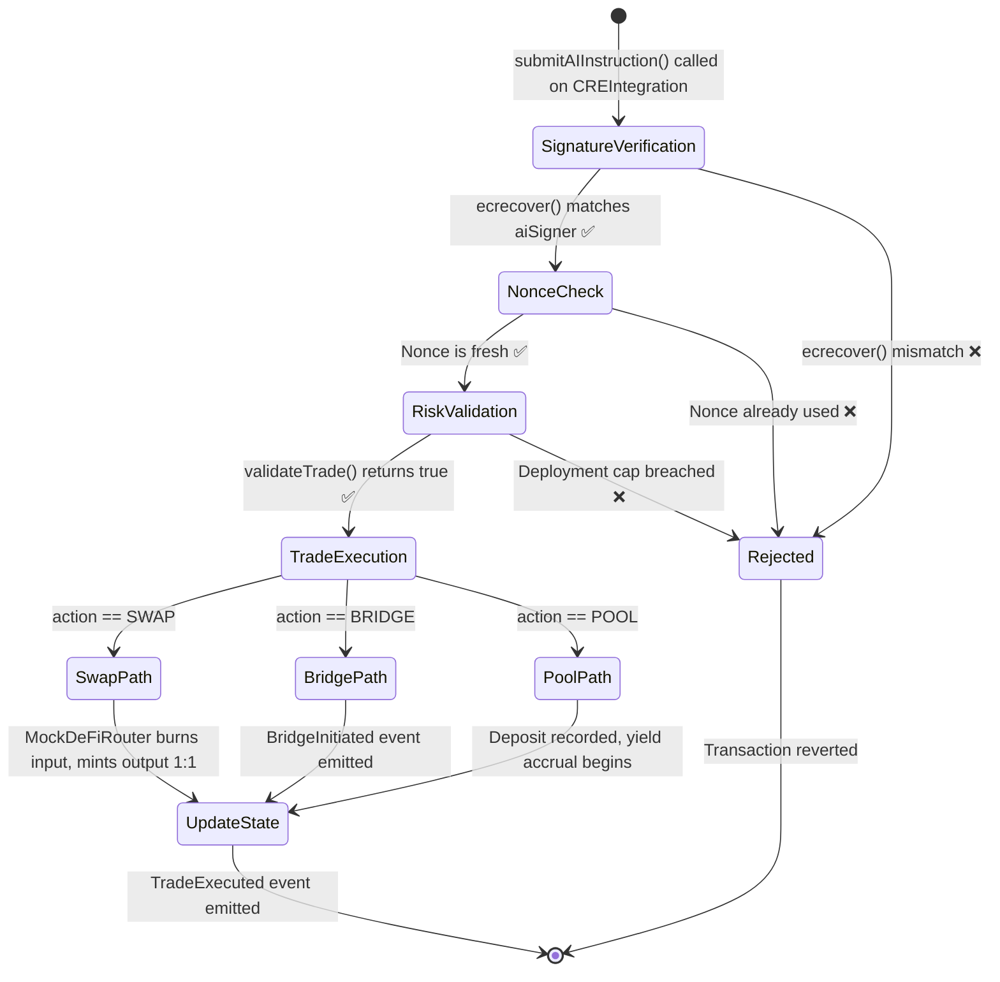
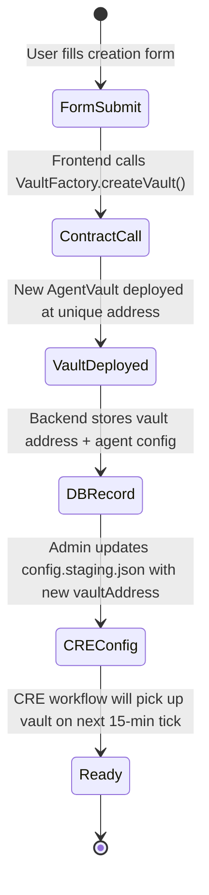
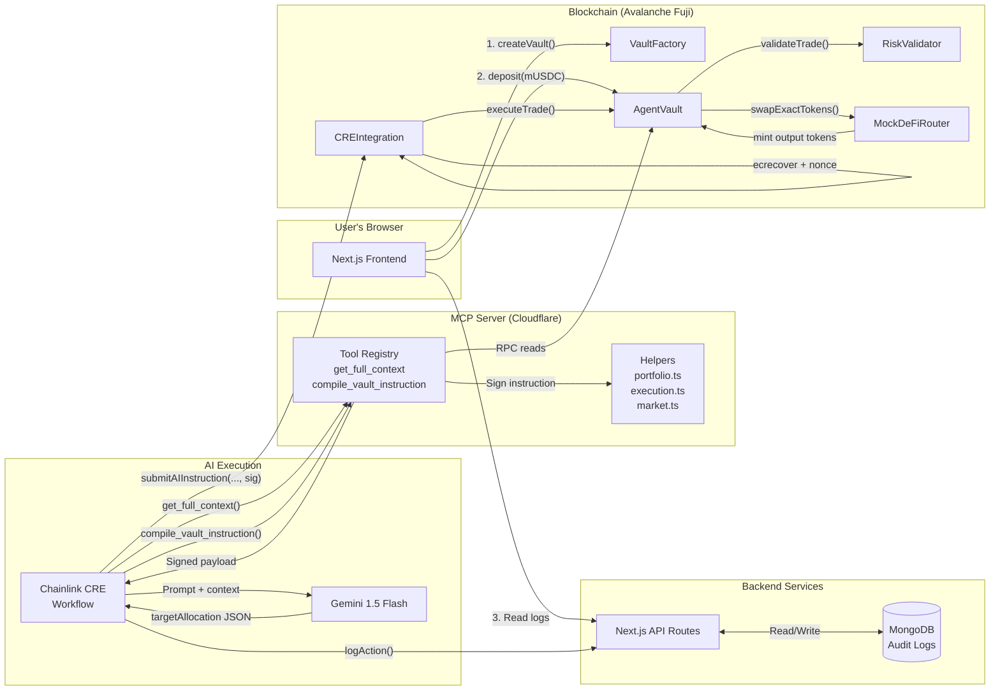

# XMind Capital — Technical Product Overview

> A comprehensive breakdown of the architecture, feature prioritization, user journey, and component structure.

---

## Table of Contents

1. [Tech Stack & Architecture Decisions](#1-tech-stack--architecture-decisions)
2. [Feature Prioritization — MoSCoW Framework](#2-feature-prioritization--moscow-framework)
3. [User Journey](#3-user-journey)
4. [Components, Workflows & Technical Structure](#4-components-workflows--technical-structure)

---

## 1. Tech Stack & Architecture Decisions

### The Core Philosophy: Separation of Concerns

Every architectural decision in XMind Capital flows from one guiding principle:

> **The AI reasons in the cloud. The blockchain enforces the rules. The two layers cannot override each other.**

This separation prevents the two most common failure modes in AI-DeFi integrations:
- An AI with unchecked access drains funds through hallucinated trades.
- An overly restrictive on-chain design can't respond to dynamic market conditions.

---

### Layer 1: The Blockchain — Avalanche Fuji / C-Chain

**Why Avalanche?**

| Factor | Decision |
|---|---|
| **Transaction speed** | Avalanche's sub-2-second finality means AI cycles feel responsive, not sluggish. |
| **EVM compatibility** | Full Solidity/Hardhat/Ethers.js compatibility with zero porting cost. |
| **Low gas costs** | The AI can afford to make frequent, smaller rebalancing trades without gas eating all yield. |
| **ERC-4626 suitability** | The C-Chain's EVM supports the complete ERC-4626 tokenized vault standard out of the box. |

**Why ERC-4626 for the vault?**

ERC-4626 is the "Tokenized Vault Standard." It wasn't just chosen for standards compliance — it was chosen because it makes NAV tracking automatic. The `totalAssets()` function override is the single source of truth for what the vault is worth. When the AI executes a trade that gains value, the share price rises automatically for all depositors. No manual accounting. No reconciliation.

**Smart Contract Design Principles:**
- **Library over Inheritance**: `RiskValidator` is a library, not an inherited contract. This keeps the risk logic stateless, which means it's impossible to manipulate by changing state.
- **Signature at the boundary**: `CREIntegration` sits as a dedicated contract between the AI and the vault. The vault itself never validates a signature — that concern is fully isolated.
- **Mock before mainnet**: Deploying `MockDeFiRouter` that matches the exact interface of real protocols (Trader Joe, Stargate) allows the entire execution pipeline to be validated without needing live liquidity.

---

### Layer 2: The AI Execution Environment — Chainlink CRE

**Why Chainlink CRE?**

The Chainlink Custom Runtime Environment is a **secure, off-chain sandbox** for running arbitrary logic that culminates in on-chain writes. It is not a general compute platform — it is specifically designed for trusted oracle-style execution.

Choosing CRE over naive alternatives:

| Alternative | Problem |
|---|---|
| Direct AI → MetaMask | The private key is exposed in the browser. Any XSS vulnerability compromises all funds. |
| Backend server with private key | Centralized point of failure; the operator can be compromised or coerced. |
| AI wallet directly on-chain | Smart contract wallets don't reason about market conditions — they just execute instructions. |
| **Chainlink CRE (chosen)** | Cryptographically attested execution. The network verifies that the right code ran and produced the signature, not just that the signature is valid. |

**The 5-call constraint and how we solved it:**

The CRE imposes a maximum of **5 HTTP fetch calls** per workflow execution. This is a deliberate security boundary — limiting surface area for external data manipulation. Our original naive design used:
- Call 1: `get_vault_state`
- Call 2: `get_market_snapshot`
- Call 3: `analyze_portfolio_risk`
- Call 4: Gemini AI
- Call 5: `logAction`

That left **zero budget** for the instruction compilation step. The solution was a server-side aggregation pattern: the `get_full_context` MCP endpoint runs all three data operations in parallel internally and returns a single merged JSON response. This reclaimed 2 slots for `compile_vault_instruction` and `logAction`.

---

### Layer 3: The Intelligence Layer — Model Context Protocol (MCP) Server on Cloudflare Workers

**Why MCP?**

The Model Context Protocol is an open standard by Anthropic that defines how AI assistants communicate with external tools. Instead of building a bespoke API that Gemini queries, MCP gives us a standardized, introspectable tool registry. The key benefit: **tools are described semantically** (name, description, parameter schema), which means the AI can understand *what* a tool does without having it spelled out in the prompt.

**Why Cloudflare Workers?**

- **Edge-deployed**: Low latency for the CRE workflow's tight HTTP budget.
- **No cold starts**: Workers are always warm, which matters for a time-sensitive 15-minute cycle.
- **Wrangler DX**: Local development with `wrangler dev` mirrors production exactly.
- **No server management**: Scales automatically; no infrastructure overhead.

**Why Google Gemini 1.5 Flash?**

| Factor | Reasoning |
|---|---|
| **Context window** | 1M token context window. The AI can reason about complex market context without truncation. |
| **Speed** | Flash is optimized for low-latency inference — critical within a real-time trading cycle. |
| **JSON output quality** | Gemini 1.5 Flash reliably outputs structured JSON (the `targetAllocation` block) when prompted correctly. |
| **Cost** | Lower cost than frontier models, sustainable for per-cycle AI calls. |

---

### Layer 4: The Frontend — Next.js 15 App Router

**Why Next.js App Router over a SPA?**

Vault data is read-only for most views — NAV, logs, position breakdowns. Server Components render this data on the server and send HTML to the client, meaning:
- No waterfalls waiting for JS to load before fetching data.
- Sensitive RPC calls stay on the server, not exposed in client bundles.
- API routes in the same codebase serve as the backend for MongoDB writes (audit log submissions from the CRE workflow).

**Why MongoDB for AI logs?**

The AI reasoning text from Gemini and the signed instruction payloads are unstructured, variable-length documents. A relational schema would require frequent migrations as the format evolves. MongoDB's document model lets us store the full AI response verbatim alongside the instruction, the timestamp, and the vault address — no schema changes needed.

---

## 2. Feature Prioritization — MoSCoW Framework

The MoSCoW method (Must Have, Should Have, Could Have, Won't Have) was used to make disciplined decisions about what to build during the hackathon sprint phase.

---

### ✅ MUST HAVE — The Core Protocol Loop Must Work

These features are non-negotiable. Without them, the project has no value proposition.

| Feature | Justification | Status |
|---|---|---|
| **ERC-4626 AgentVault** | The fundamental capital container. No vault = no protocol. | ✅ Done |
| **CREIntegration signature verification** | Ensures the AI's instructions are cryptographically authenticated before any capital moves. The entire security model depends on this. | ✅ Done |
| **RiskValidator on-chain library** | The hard guarantee to users that the AI cannot drain their capital. Without this, the project is not safe to demo. | ✅ Done |
| **VaultFactory** | Users need a way to create their own vaults. A hardcoded single vault is not a protocol. | ✅ Done |
| **Chainlink CRE Workflow** | The autonomous execution engine. The AI must be able to act without human intervention. | ✅ Done |
| **MCP Server with `get_full_context`** | The AI needs data. Without context, Gemini cannot generate meaningful trade decisions. | ✅ Done |
| **`compile_vault_instruction` (EIP-191 signing)** | Converts AI intent into a blockchain-submittable payload. The bridge between the AI layer and the contract layer. | ✅ Done |
| **MockDeFiRouter for testnet execution** | Testnet DEX liquidity is unreliable. Without mocks, the execution pipeline breaks on every trade. | ✅ Done |
| **Frontend vault dashboard** | Visibility into AI behavior is the product. Users must be able to see what the AI is doing and why. | ✅ Done |
| **AI audit log storage** | Regulatory and trust requirement. Every AI decision and its signed payload must be recorded. | ✅ Done |

---

### 🟡 SHOULD HAVE — Significant Value, Achievable in Sprint

These features dramatically improve the quality of the product but the core loop works without them.

| Feature | Justification | Status |
|---|---|---|
| **Multi-asset allocation** | Gemini recommends splitting allocation across AVAX, ETH, and BTC. The compile step currently only handles the first asset. Supporting multi-leg trade compilation improves capital efficiency. | 🔄 Partial |
| **Frontend wallet connection (MetaMask)** | Users should connect their own wallet to deposit into vaults, not use a test account. Improves demo authenticity. | ✅ Done |
| **Agent creation wizard UI** | The `VaultFactory` is deployed, but the frontend creation form needs to be wired to the contract. | ✅ Done |
| **Live NAV chart** | A time-series chart of vault NAV over time makes the AI's performance tangible to judges. | 🔄 Partial |
| **`harvestYield()` on MockDeFiRouter** | Simulates 2% APY from lending pools. Shows the POOL action type working end-to-end. | ✅ Done |
| **Zod config validation in CRE workflow** | Prevents silent failures if the config file is malformed. Surfaces errors early in the execution cycle. | ✅ Done |

---

### 🔵 COULD HAVE — Nice, Won't Break Sprint if Deferred

| Feature | Justification | Status |
|---|---|---|
| **EIP-712 typed-data signing** | Upgrade from EIP-191 for better on-chain readability and UX in future wallet integrations. | ❌ Deferred |
| **Multi-agent vault orchestration** | Multiple specialized AI agents (one for risk, one for trading) counter-signing each other's decisions. Adds a second layer of AI governance. | ❌ Deferred |
| **Subgraph for historical NAV** | The Graph Protocol indexer for on-chain event data, powering rich historical charts. | ❌ Deferred |
| **Configurable Gemini prompt templates** | Let the vault creator customize the AI's personality, risk appetite, and target assets through the UI. | ❌ Deferred |
| **Push notifications on trade execution** | Email or webhook notifications when the AI executes a trade, so users don't need to poll the dashboard. | ❌ Deferred |
| **Gas cost optimization pass** | The `AgentVault` can be made more gas-efficient with packing and batch updates. | ❌ Deferred |

---

### ❌ WON'T HAVE — Explicitly Out of Scope

These features were evaluated and consciously excluded to prevent scope creep.

| Feature | Reason Excluded |
|---|---|
| **Live mainnet deployment** | Mainnet requires a security audit. Deploying unaudited contracts managing real funds is unethical and would disqualify the project from responsible disclosure standards. |
| **Agent-to-agent micropayments (x402)** | This was from the prior Cronos project. While interesting, grafting a payment layer onto the Avalanche architecture adds weeks of integration work for a feature that doesn't strengthen the core thesis. |
| **DAO governance for vault parameters** | Token-based governance requires a token launch, tokenomics design, and voting contract. Way outside sprint scope. |
| **Mobile app** | A responsive web dashboard covers mobile sufficiently for the hackathon. A native app is a post-funding activity. |
| **Cross-chain vault bridging** | While Stargate is mocked in the router, actual cross-chain vault accounting (tracking assets deployed on another chain in the ERC-4626 share price) requires complex oracle infrastructure. |

---

## 3. User Journey

The full XMind Capital user journey has two distinct actor types:

- **Vault Deployer (Investor/Creator)**: Creates and funds a vault, configures an AI strategy.
- **The AI Agent**: Autonomously manages the vault according to its strategy mandate.

### Act 1: Discovery & Setup



**Step-by-step walkthrough:**

**Step 1 — Connect Wallet**
The user opens the XMind Capital frontend and connects their MetaMask wallet. The app reads their address and checks the backend for any existing agents associated with this wallet.

**Step 2 — Create a Vault Agent**
The user clicks "Deploy New Agent" and fills in the creation form:
- **Name**: e.g., "Aggressive Momentum Multi-Asset"
- **Strategy**: The AI's mandate — e.g., "Exploit short-term AVAX/ETH volatility for alpha"
- **Risk Profile**: Conservative (40% max deploy), Balanced (60%), Aggressive (80%)

Clicking "Deploy" calls `VaultFactory.createVault()` on Avalanche Fuji. A new isolated `AgentVault` contract is deployed. Its address is stored in the factory registry and in the backend database.

**Step 3 — Fund the Vault**
The user transfers `mUSDC` (testnet stable) into the newly deployed vault using `AgentVault.deposit()`. In return, they receive vault shares — ERC-20 tokens that represent their proportional ownership. The current share price is `1:1` (vault is new, no yield yet). The NAV counter on the dashboard immediately reflects the deposit.

---

### Act 2: The Autonomous AI Cycle (Every 15 Minutes)

This happens entirely without the user's involvement. The user's role here is **observer**.

**Step 4 — CRE Wakes Up**
The Chainlink CRE cron job fires. It reads the workflow config and confirms `tradingEnabled: true` for this vault.

**Step 5 — Context Gathering (HTTP Call 1)**
The workflow calls `get_full_context(vaultAddress)` on the MCP server. The server simultaneously:
- Queries the `AgentVault` contract for `totalAssets()`, cash balance, and risk profile.
- Reads mock market prices (AVAX: $38.42, ETH: $2,840, BTC: $52,140).
- Computes a risk score (Value-at-Risk, liquidity risk, safety recommendation).

All three results are merged and returned in a single response. The AI now has a complete picture of the world.

**Step 6 — AI Deliberates (HTTP Call 2)**
The CRE workflow constructs a detailed prompt for Gemini 1.5 Flash:

```
You are an aggressive algorithmic trader managing an ERC-4626 vault.
Risk Profile: conservative. Max Position Size: 10%.

Current vault state:
- Total NAV: $55.00 (100% idle in mUSDC)
- Market: AVAX=$38.42, ETH=$2840, neutral-bullish sentiment
- Risk Assessment: Safety score 82/100. "Safe to deploy capital."

Your mandate: Maximize alpha through momentum trading on AVAX, ETH, and LINK.
Respond with your assessment and a targetAllocation JSON block.
```

Gemini responds with structured reasoning and a JSON target:
```json
{ "targetAllocation": { "AVAX": 0.10, "ETH": 0.10 } }
```

**Step 7 — Instruction Compilation (HTTP Call 3)**
The workflow extracts the `targetAllocation` JSON from Gemini's response and calls `compile_vault_instruction` on the MCP server. The server:
1. Re-reads the current vault state to calculate the exact trade delta.
2. Computes the Wei-denominated amount: `55 * 0.1 = $5.50 → 5,500,000 (6 decimals)`.
3. Resolves the asset address: `AVAX → 0xDcc17...` (deployed mWAVAX).
4. Generates a fresh nonce (`Date.now()`).
5. Creates the message hash: `keccak256(vault ++ asset ++ amount ++ minAmountOut ++ action ++ isHighRisk ++ nonce ++ data)`.
6. Signs it with EIP-191 using the `aiSignerKey`.

The server returns the fully-formed, signed instruction payload.

**Step 8 — Audit Log (HTTP Call 4)**
The workflow logs the full AI reasoning text and the signed instruction to MongoDB via the backend API. This becomes visible to the user on the dashboard as a new entry in the "AI Execution Logs" panel.

---

### Act 3: The User Reviews the Audit Trail

**Step 9 — Open the Dashboard**
The user visits `/agents/[id]` and sees a new entry in the execution log. It shows:
- Gemini's full written assessment ("The vault is 100% idle... Safe to deploy... Allocating 10% to AVAX...")
- The `targetAllocation` JSON it produced
- The signed instruction: vault address, asset address, amount, nonce, and hex signature

**Step 10 — Understanding the Output**
The user can verify the cryptographic signature themselves using any EIP-191 compatible tool. The signature, combined with the known `aiSigner` address, proves that the Chainlink CRE node ran the workflow and produced this output — not a human, not a script, not a server.

**Step 11 — Withdrawal (anytime)**
The user can call `AgentVault.withdraw()` at any time. The `RiskValidator` ensures at least 40% of the vault remains idle, guaranteeing there is always liquid USDC available for redemption without forcing the AI to unwind positions.

---

## 4. Components, Workflows & Technical Structure

### Repository Structure

```
xmind/
├── contracts/              # Solidity smart contracts (Hardhat)
│   ├── contracts/
│   │   ├── AgentVault.sol          # ERC-4626 vault core
│   │   ├── CREIntegration.sol      # Signature gateway
│   │   ├── VaultFactory.sol        # Vault deployer
│   │   ├── RiskValidator.sol       # Risk library
│   │   ├── MockDeFiRouter.sol      # Testnet execution simulator
│   │   ├── ERC20Mock.sol           # Mintable test tokens
│   │   └── interfaces/             # IJoeRouter02, IStargateRouter
│   └── scripts/                    # Deployment & admin scripts
│
├── xmind-mcp/              # MCP Server (Cloudflare Workers + TypeScript)
│   └── src/
│       ├── index.ts                # MCP tool registry + REST handlers
│       └── helpers/
│           ├── portfolio.ts        # getVaultState() — RPC calls
│           ├── market.ts           # getMarketSnapshot() — price feeds
│           ├── strategy.ts         # analyzePortfolioRisk()
│           ├── execution.ts        # compileVaultInstruction() + signTradeInstruction()
│           └── avalanche.ts        # EIP-191 signing + token helpers
│
├── xmind-cre/              # Chainlink CRE Workflow (TypeScript)
│   └── xmind-workflow/
│       ├── main.ts                 # Orchestrator (triggers, HTTP calls, AI loop)
│       ├── config.staging.json     # Vault address, MCP URL, Gemini key
│       └── cre-settings.toml       # CRE network & capability declarations
│
└── frontend/               # Next.js 15 App Router
    ├── app/
    │   ├── dashboard/              # Vault overview grid
    │   ├── agents/[id]/            # Per-vault AI logs, NAV, positions
    │   ├── create/                 # Vault creation wizard
    │   └── api/                    # Backend routes (MongoDB reads/writes)
    ├── hooks/
    │   ├── useDeployContract.tsx   # VaultFactory.createVault() wrapper
    │   └── useVaultState.tsx       # Live on-chain reads
    └── components/
        ├── vault-stats.tsx         # NAV, utilization, risk mode display
        └── vault-history.tsx       # AI execution log list
```

---

### Core Workflows in Detail

#### Workflow A: The AI Trading Cycle



#### Workflow B: The On-Chain Execution Flow



#### Workflow C: Vault Creation by User



---

### Data Flow Between All Components



---

### Key Technical Decisions Summary

| Decision | Alternative Considered | Why We Chose This |
|---|---|---|
| ERC-4626 vault standard | Custom vault with manual accounting | Automatic NAV via `totalAssets()` override; composable with future DeFi integrations |
| Stateless `RiskValidator` library | Upgradeable proxy contract | Libraries have no state to manipulate; the risk rules are immutable by design |
| `get_full_context` aggregation | 3 separate MCP endpoints | Required to stay within the 5 HTTP call limit imposed by Chainlink CRE |
| MCP as tool interface | REST API with custom schema | MCP is semantically self-describing; Gemini understands tool purpose from the description alone |
| EIP-191 signing | EIP-712 typed data | Simpler integration with `ethers.signMessage()` for the hackathon; EIP-712 is the upgrade path |
| MongoDB for AI logs | PostgreSQL | AI reasoning text is variable-length, unstructured; document store avoids migrations as format evolves |
| Cloudflare Workers for MCP | AWS Lambda / Express server | Zero cold starts, edge-deployed, `wrangler dev` matches production exactly |
| MockDeFiRouter match real interfaces | Stub out execution entirely | Real interfaces mean zero contract changes when upgrading to mainnet protocols |
