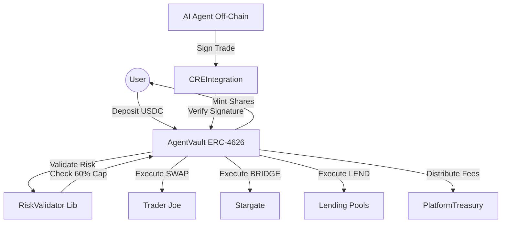

# XMind Capital: AI-Driven DeFi Vaults (Avalanche)

XMind Capital is a professional smart contract infrastructure for deploying AI-managed investment vaults on the Avalanche blockchain. It leverages the ERC-4626 standard and on-chain risk guardrails to enable AI agents to manage user capital securely across DEXs, bridges, and lending protocols.

## 🏗️ Architecture Overview

The system is designed to bridge the gap between off-chain AI strategy and on-chain capital security.



## 📋 Core Components

### 1. `AgentVault.sol` (ERC-4626)
The heart of the system. Each vault represents a specific AI strategy.
- **NAV Tracking**: Calculates Net Asset Value (NAV) by summing idle cash and active investments.
- **Action Suite**: Executes `SWAP` (Trader Joe), `BRIDGE` (Stargate), and `POOL` (Lending) actions.
- **Fee Management**: Automatically distributes performance fees to the platform treasury.

### 2. `VaultFactory.sol`
Enables the rapid deployment of new AI strategy vaults.
- Maintains a registry of all deployed vaults.
- Standardizes protocol router addresses (Trader Joe, Stargate) across all agents.

### 3. `RiskValidator.sol` (Library)
A stateless guardrail that protects user capital from aggressive AI behavior.
- **Risk Profiles**: Enforces Conservative, Balanced, or Aggressive limits.
- **40% Liquidity Buffer**: Strictly prevents the AI from investing more than 60% of the vault's assets, ensuring liquidity for immediate withdrawals.

### 4. `CREIntegration.sol`
The secure gateway for AI instructions.
- Uses EIP-712-style signature verification to ensure only the authorized AI signer can trigger trades.
- Prevents replay attacks using a nonce-based system.

## 🚀 Getting Started

### Installation
```bash
cd contracts
npm install
```

### Compilation
```bash
npx hardhat compile
```

### Deployment (Avalanche Fuji)
1. Configure your `.env` with `PRIVATE_KEY` and `SNOWTRACE_API_KEY`.
2. Run the deployment script:
```bash
npx hardhat run scripts/deploy_avax.js --network avalancheFuji
```

## 🧪 Safety Features

- **Net Asset Value (NAV)**: Shares are always priced based on the total portfolio value (Cash + Active Trades).
- **Hard Liquidity Cap**: 40% of every deposit is kept as idle USDC by default to satisfy user withdrawals.
- **Signature Auth**: No one, not even the owner, can execute a trade without a valid AI-signed instruction.

## 📁 Project Structure
- `contracts/`: Core Solidity logic.
- `scripts/`: Deployment and interaction scripts.
- `test/`: Comprehensive unit tests for withdrawals, risk, and integration.

