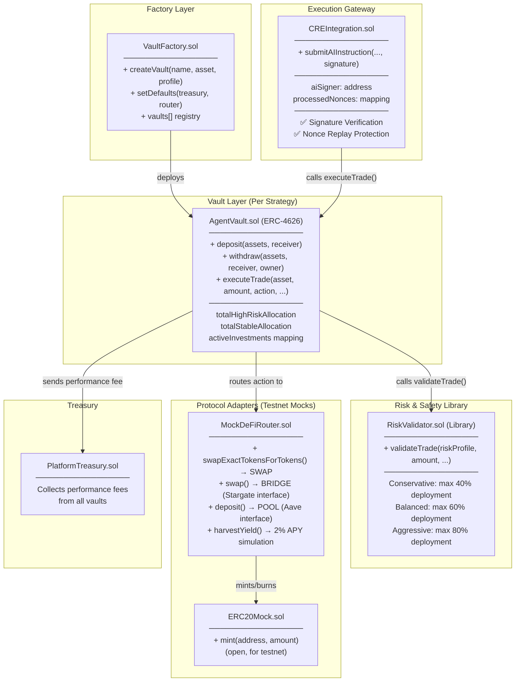
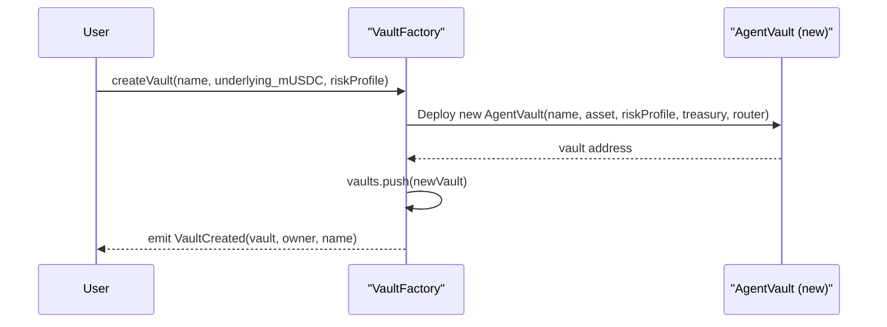
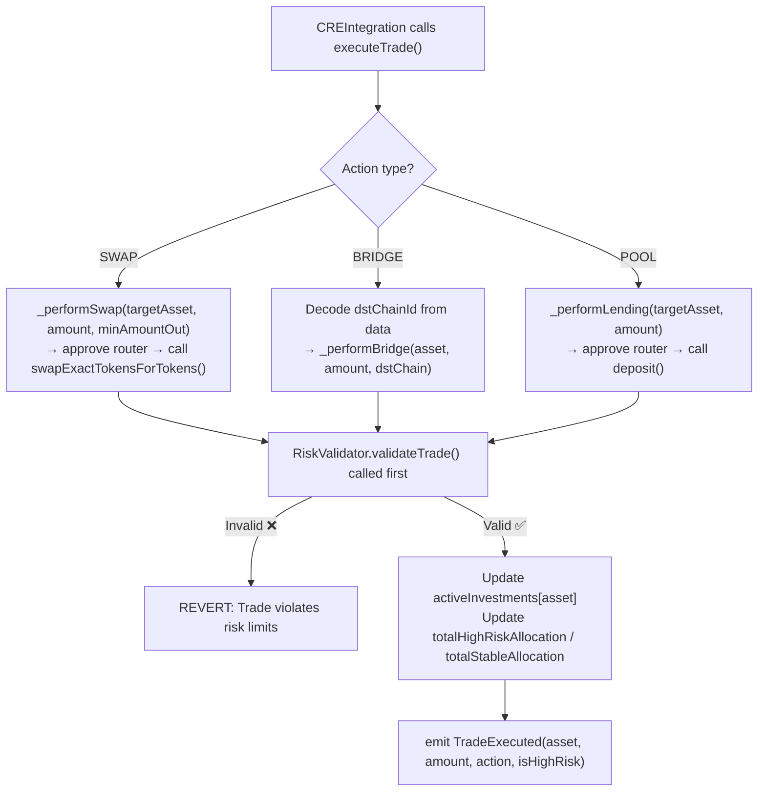
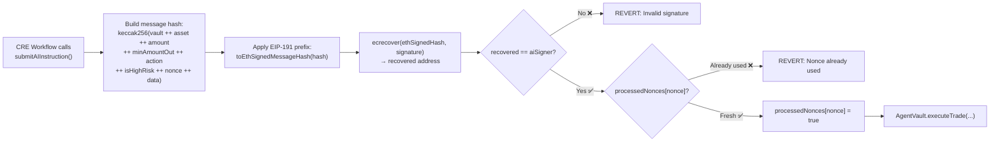

# XMind Capital — Smart Contracts

> **Trustless financial guardrails for AI-managed DeFi vaults on Avalanche**

This directory contains the full smart contract suite powering XMind Capital. The contracts implement the "enforcer" half of the protocol: they receive cryptographically signed instructions from the AI agent and execute them only after verifying the signature, validating the risk, and enforcing all capital constraints.

The fundamental guarantee of the system is this: **no AI instruction, regardless of how it was generated, can bypass the on-chain risk rules.**

---

## 📐 Contract Architecture


```mermaid
graph TB
    subgraph "Factory Layer"
        VF["VaultFactory.sol<br/>─────────────────<br/>+ createVault(name, asset, profile)<br/>+ setDefaults(treasury, router)<br/>+ vaults[] registry"]
    end

    subgraph "Vault Layer (Per Strategy)"
        AV["AgentVault.sol (ERC-4626)<br/>─────────────────<br/>+ deposit(assets, receiver)<br/>+ withdraw(assets, receiver, owner)<br/>+ executeTrade(asset, amount, action, ...)<br/>─────────────────<br/>totalHighRiskAllocation<br/>totalStableAllocation<br/>activeInvestments mapping"]
    end

    subgraph "Execution Gateway"
        CI["CREIntegration.sol<br/>─────────────────<br/>+ submitAIInstruction(..., signature)<br/>─────────────────<br/>aiSigner: address<br/>processedNonces: mapping<br/>─────────────────<br/>✅ Signature Verification<br/>✅ Nonce Replay Protection"]
    end

    subgraph "Risk & Safety Library"
        RV["RiskValidator.sol (Library)<br/>─────────────────<br/>+ validateTrade(riskProfile, amount, ...)<br/>─────────────────<br/>Conservative: max 40% deployment<br/>Balanced: max 60% deployment<br/>Aggressive: max 80% deployment"]
    end

    subgraph "Protocol Adapters (Testnet Mocks)"
        MDR["MockDeFiRouter.sol<br/>─────────────────<br/>+ swapExactTokensForTokens() → SWAP<br/>+ swap() → BRIDGE (Stargate interface)<br/>+ deposit() → POOL (Aave interface)<br/>+ harvestYield() → 2% APY simulation"]
        ERC["ERC20Mock.sol<br/>─────────────────<br/>+ mint(address, amount)<br/>(open, for testnet)"]
    end

    subgraph "Treasury"
        PT["PlatformTreasury.sol<br/>─────────────────<br/>Collects performance fees<br/>from all vaults"]
    end

    VF -->|"deploys"| AV
    CI -->|"calls executeTrade()"| AV
    AV -->|"calls validateTrade()"| RV
    AV -->|"routes action to"| MDR
    MDR -->|"mints/burns"| ERC
    AV -->|"sends performance fee"| PT
```

---

## 📋 Contract Breakdown

### `VaultFactory.sol`

The factory is the **entry point for vault creation**. Users and the frontend interact with this contract to spawn new, independent `AgentVault` instances.


```mermaid
sequenceDiagram
    participant User
    participant VF as "VaultFactory"
    participant AV as "AgentVault (new)"

    User->>VF: createVault(name, underlying_mUSDC, riskProfile)
    VF->>AV: Deploy new AgentVault(name, asset, riskProfile, treasury, router)
    AV-->>VF: vault address
    VF->>VF: vaults.push(newVault)
    VF-->>User: emit VaultCreated(vault, owner, name)
```

**Key responsibilities:**
- Holds default router address (`MockDeFiRouter` on testnet, Trader Joe on mainnet).
- Maintains a registry array of all deployed vaults.
- `setDefaults(treasury, router)` — allows the admin to deploy new protocol adapters without redeploying the factory.

---

### `AgentVault.sol` (ERC-4626)

This is the **heart of the protocol**. Every vault is its own sovereign ERC-4626 contract. Users deposit `mUSDC` (or USDC on mainnet) and receive vault shares in return. Shares are priced in real-time based on the vault's **Net Asset Value (NAV)**.

**NAV Calculation:**
```
NAV = Idle mUSDC balance + totalHighRiskAllocation + totalStableAllocation
```

The `totalAssets()` override uses this formula, meaning share price automatically appreciates when the AI generates yield, and dilutes if a trade loses value.

**The `executeTrade` function — the only way to move capital:**


```mermaid
flowchart TD
    A["CREIntegration calls executeTrade()"] --> B{"Action type?"}
    B -- "SWAP" --> C["_performSwap(targetAsset, amount, minAmountOut)<br/>→ approve router → call swapExactTokensForTokens()"]
    B -- "BRIDGE" --> D["Decode dstChainId from data<br/>→ _performBridge(asset, amount, dstChain)"]
    B -- "POOL" --> E["_performLending(targetAsset, amount)<br/>→ approve router → call deposit()"]

    C --> F["RiskValidator.validateTrade() called first"]
    D --> F
    E --> F

    F -- "Invalid ❌" --> G["REVERT: Trade violates risk limits"]
    F -- "Valid ✅" --> H["Update activeInvestments[asset]<br/>Update totalHighRiskAllocation / totalStableAllocation"]
    H --> I["emit TradeExecuted(asset, amount, action, isHighRisk)"]
```

**Risk State Tracking:**
```solidity
// Every executed trade updates these accumulators
if (isHighRisk) {
    totalHighRiskAllocation += amount;
} else {
    totalStableAllocation += amount;
}

// Active positions are tracked per asset
activeInvestments[targetAsset] = Investment(targetAsset, amount, isHighRisk, action);
```

---

### `CREIntegration.sol`

This is the **security boundary** between off-chain AI instructions and on-chain execution. Nothing gets to the vault without passing through this contract.

**Signature Verification Flow:**


```mermaid
flowchart LR
    A["CRE Workflow calls<br/>submitAIInstruction()"] --> B["Build message hash:<br/>keccak256(vault ++ asset ++ amount<br/>++ minAmountOut ++ action<br/>++ isHighRisk ++ nonce ++ data)"]
    B --> C["Apply EIP-191 prefix:<br/>toEthSignedMessageHash(hash)"]
    C --> D["ecrecover(ethSignedHash, signature)<br/>→ recovered address"]
    D --> E{"recovered == aiSigner?"}
    E -- "No ❌" --> F["REVERT: Invalid signature"]
    E -- "Yes ✅" --> G{"processedNonces[nonce]?"}
    G -- "Already used ❌" --> H["REVERT: Nonce already used"]
    G -- "Fresh ✅" --> I["processedNonces[nonce] = true"]
    I --> J["AgentVault.executeTrade(...)"]
```

**Why EIP-191 and not EIP-712?**
We use the simpler EIP-191 (personal_sign prefix) for the testnet because it works directly with `ethers.signMessage()` without requiring a full typed-data domain. The production upgrade path is to EIP-712, which provides better on-chain readability and is more gas-efficient for complex payloads.

**Anti-replay protection:**
Every signed instruction includes a timestamp-based nonce (`Date.now()` in the MCP server). The `processedNonces` mapping ensures that even if an identical signed instruction is resubmitted, it will be rejected after the first execution.

---

### `RiskValidator.sol` (Library)

The RiskValidator is a **stateless library** — it has no storage, no state, and receives everything it needs as function arguments. This is a deliberate design choice: the validator is impossible to manipulate since it holds nothing persistent.

**Risk Profile Thresholds:**

| Profile | Max Total Deployment | Meaning |
|---|---|---|
| Conservative (0) | 40% of NAV | 60% must remain idle as USDC |
| Balanced (1) | 60% of NAV | 40% liquidity buffer |
| Aggressive (2) | 80% of NAV | 20% minimum liquidity buffer |

**What it checks:**
```solidity
function validateTrade(
    uint8 riskProfile,
    address targetAsset,
    uint256 amount,
    string memory targetAssetType, // "stable" or "volatile"
    uint256 currentHighRisk,
    uint256 currentStable,
    uint256 totalNAV,
    bool isHighRisk
) external pure returns (bool) {
    // 1. Will this trade push total deployment over the profile cap?
    uint256 totalDeployed = currentHighRisk + currentStable + amount;
    uint256 maxDeployment = (totalNAV * maxDeployPercent[riskProfile]) / 100;
    if (totalDeployed > maxDeployment) return false;

    // 2. For a Conservative profile, no single trade can be marked high-risk
    if (riskProfile == 0 && isHighRisk) return false;

    return true;
}
```

---

### `MockDeFiRouter.sol`

On Avalanche Fuji testnet, real DEX liquidity is sparse and bridges are often non-functional. `MockDeFiRouter` implements the exact same function signatures as Trader Joe (`IJoeRouter02`) and Stargate (`IStargateRouter`), but replaces real execution with safe, predictable simulation.

**Interface implementations:**

| Real Protocol | Interface Implemented | Mock Behavior |
|---|---|---|
| Trader Joe | `IJoeRouter02` | `swapExactTokensForTokens()` burns input token from vault, mints output token 1:1 to vault |
| Stargate | `IStargateRouter` | `swap()` emits `BridgeInitiated` event, no token movement |
| Aave | Deposit interface | `deposit()` records amount, `harvestYield()` mints 2% as simulated yield |

**Why this matters:**
Because `AgentVault` calls the router through the standard interface, **zero changes** are needed to the vault contract when upgrading from testnet mocks to production adapters. Only `VaultFactory.setDefaults(newRouter)` needs to be called.

---

### `ERC20Mock.sol`

A minimal ERC-20 with an open `mint()` function. Used for:
- `mUSDC` — vault's base asset
- `mWAVAX`, `mWETH`, `mWBTC` — target swap assets

The `MockDeFiRouter` calls `mint()` on the appropriate token contract to simulate receiving assets post-swap.

---

## 🔐 Security Properties

| Property | How It's Enforced |
|---|---|
| **Only AI can trade** | `CREIntegration` verifies `ecrecover(sig) == aiSigner` before calling the vault |
| **No replay attacks** | `processedNonces[nonce]` mapping prevents re-submission of the same signed instruction |
| **No reentrancy** | `AgentVault` inherits `ReentrancyGuard` from OpenZeppelin; `nonReentrant` on `executeTrade` and `withdraw` |
| **Capital caps enforced** | `RiskValidator.validateTrade()` REVERTS if deployment exceeds profile threshold — AI cannot override this |
| **Emergency pause** | `AgentVault` inherits `Pausable`; guardian can pause all trading without touching user withdrawals |
| **Ownable** | `VaultFactory` and `AgentVault` use `Ownable`; only the vault creator can call `pause/unpause` and set risk profiles |

---

## 🚀 Deployment

### Prerequisites
```bash
cd contracts
npm install
npx hardhat compile
```

### Environment Variables (`.env`)
```env
PRIVATE_KEY=your_deployer_private_key
SNOWTRACE_API_KEY=your_snowtrace_key
FUJI_RPC_URL=https://api.avax-test.network/ext/bc/C/rpc
```

### Deploy to Avalanche Fuji
```bash
# Deploy mock infrastructure (VaultFactory + MockDeFiRouter + Mock Tokens)
npx hardhat run scripts/deploy-testnet-mocks.js --network avalancheFuji

# Create a new vault through the factory
npx hardhat run scripts/create-vault.js --network avalancheFuji

# (Re)set default router address on VaultFactory
npx hardhat run scripts/set-defaults.js --network avalancheFuji

# Update the CREIntegration's authorized aiSigner
npx hardhat run scripts/set-ai-signer.js --network avalancheFuji
```

---

## 📁 Project Structure

```
contracts/
├── contracts/
│   ├── AgentVault.sol          # ERC-4626 vault — core capital container
│   ├── CREIntegration.sol      # Signature verification gateway
│   ├── VaultFactory.sol        # Deploys new AgentVault instances
│   ├── PlatformTreasury.sol    # Receives performance fees
│   ├── MockDeFiRouter.sol      # Testnet simulation of TraderJoe + Stargate
│   ├── MockRouter.sol          # (Legacy, replaced by MockDeFiRouter)
│   ├── ERC20Mock.sol           # Mintable test tokens (mUSDC, mWAVAX, etc.)
│   ├── interfaces/
│   │   ├── IJoeRouter02.sol    # Trader Joe DEX interface
│   │   └── IStargateRouter.sol # Stargate Bridge interface
│   └── libraries/
│       └── RiskValidator.sol   # Stateless risk guardrail library
├── scripts/
│   ├── deploy-testnet-mocks.js # Main testnet deployment script
│   ├── set-defaults.js         # Updates VaultFactory router address
│   └── set-ai-signer.js        # Updates CREIntegration aiSigner
├── test/                       # Hardhat/chai unit tests
├── hardhat.config.js
└── .env
```
